# 🧠 LioraLog AI Prediction System — Complete Technical Report

> **Purpose:** This report explains, in simple English, how every part of LioraLog's AI-powered prediction system works. It covers every algorithm, formula, and decision point — from raw log data all the way to the deadline prediction you see on screen.

---

## 📋 Table of Contents

1. [System Overview](#1-system-overview)
2. [Data Model — What Goes In](#2-data-model--what-goes-in)
3. [The Prediction Pipeline — Step by Step](#3-the-prediction-pipeline--step-by-step)
4. [Step 1: Task Weighting](#step-1-task-weighting)
5. [Step 2: Velocity Calculation (EWMA)](#step-2-velocity-calculation-ewma)
6. [Step 3: Estimation Bias Detection](#step-3-estimation-bias-detection)
7. [Step 4: Completion Velocity & Trend](#step-4-completion-velocity--trend)
8. [Step 5: Risk Multiplier & Dependencies](#step-5-risk-multiplier--dependencies)
9. [Step 6: Monte Carlo Simulation](#step-6-monte-carlo-simulation)
10. [Step 7: Bayesian Confidence Score](#step-7-bayesian-confidence-score)
11. [Mood-Productivity Analysis](#mood-productivity-analysis)
12. [Risk Detection System](#risk-detection-system)
13. [Liora's Insight Cards](#lioras-insight-cards)
14. [Logging Streak System](#logging-streak-system)
15. [What-If Simulator](#what-if-simulator)
16. [Task Dependencies](#task-dependencies)
17. [Full System Flowchart](#full-system-flowchart)

---

## 1. System Overview

LioraLog uses **statistical modeling** (not machine learning) to predict when a student will finish their research project. It is designed to work well even with small amounts of data (5–50 log entries).

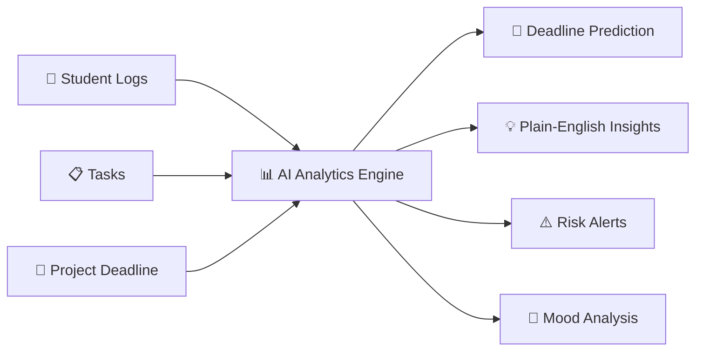

**Key Principle:** The system treats prediction as a math problem, not a guessing game. It measures your speed, adjusts for your habits, simulates hundreds of possible outcomes, and then gives you a range of dates with a confidence score.

---

## 2. Data Model — What Goes In

The system uses three types of input data:

### Log Entries (what the student records daily)
| Field | What It Means |
|-------|--------------|
| `tasksCompleted` | Text describing what was done |
| `taskStatus` | "todo", "inprogress", or "done" |
| `actualHoursSpent` | How many hours they actually worked |
| `moodRating` | 1-5 mood score |
| `problems` | Text describing issues faced |
| `feedback` | Supervisor or self-feedback |

### Tasks (the work items)
| Field | What It Means |
|-------|--------------|
| `priority` | low, medium, high, critical |
| `size` | small, medium, large, very_large |
| `difficulty` | easy, normal, hard |
| `estimatedHours` | How long the student thinks it'll take |
| `completionPercentage` | 0-100% progress |
| `status` | not_started, in_progress, completed, blocked |
| `dependsOn` | IDs of tasks this task is waiting on |

### Project
| Field | What It Means |
|-------|--------------|
| `endDate` | The project deadline |

---

## 3. The Prediction Pipeline — Step by Step

Here is the complete flow of how a prediction is calculated:

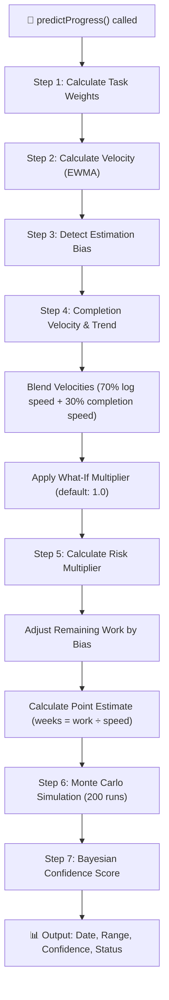

---

## Step 1: Task Weighting

**Problem:** Not all tasks are equal. A "Critical, Large, Hard" task is way more work than a "Low, Small, Easy" task.

**Solution:** Each task gets a **weight** that represents its true size:

```
Weight = (estimatedHours / 4   OR   sizeWork) × difficultyMultiplier × priorityMultiplier + descriptionBoost
```

| Factor | Values |
|--------|--------|
| **Size** | small=0.5, medium=1, large=2, very_large=3.5 |
| **Difficulty** | easy=0.85, normal=1, hard=1.35 |
| **Priority** | low=0.9, medium=1, high=1.15, critical=1.3 |
| **Description** | Longer descriptions add up to 0.2 extra weight |

**Example:** A "Large, Hard, Critical" task = 2 × 1.35 × 1.3 = **3.51 weight units**

If the student set `estimatedHours`, that is used instead of the size lookup (divided by 4 to normalize).

**Then**, progress is calculated:
- `completedWork` = sum of (weight × completion%) for all tasks
- `remainingWork` = sum of (weight × (1 - completion%)) for all tasks
- `progressPercentage` = completedWork / totalWork × 100

---

## Step 2: Velocity Calculation (EWMA)

**Problem:** How fast is the student working? And we want recent speed to matter more than old speed.

**Solution:** We use **EWMA (Exponential Weighted Moving Average)** with α = 0.4.

### How EWMA works (simple explanation):

Imagine you have weekly speeds: `[2, 3, 1, 5, 4]`

Normal average = (2+3+1+5+4) / 5 = **3.0**

EWMA gives MORE weight to recent values:
```
Start with 2
Then: 0.4 × 3 + 0.6 × 2 = 2.4
Then: 0.4 × 1 + 0.6 × 2.4 = 1.84
Then: 0.4 × 5 + 0.6 × 1.84 = 3.10
Then: 0.4 × 4 + 0.6 × 3.10 = 3.46
```

EWMA result = **3.46** (tilted toward recent values of 5 and 4)

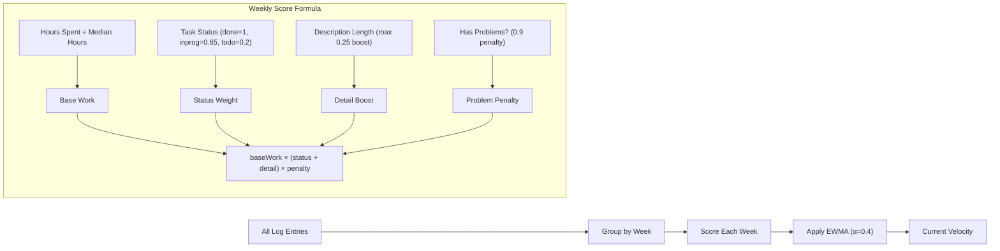

### Smart Default Hours (New Feature)
Instead of dividing hours by a hardcoded `4`, the system now calculates the **median** of all the student's actual hours spent. If a student typically works 2-hour sessions, the system auto-calibrates to use `2` instead of `4`. This makes predictions much more accurate for students who don't fill in their hours.

---

## Step 3: Estimation Bias Detection

**Problem:** Many people are bad at estimating time. Some always underestimate ("it'll take 2 hours" but it takes 6).

**Solution:** Compare actual hours spent vs estimated hours on completed tasks.

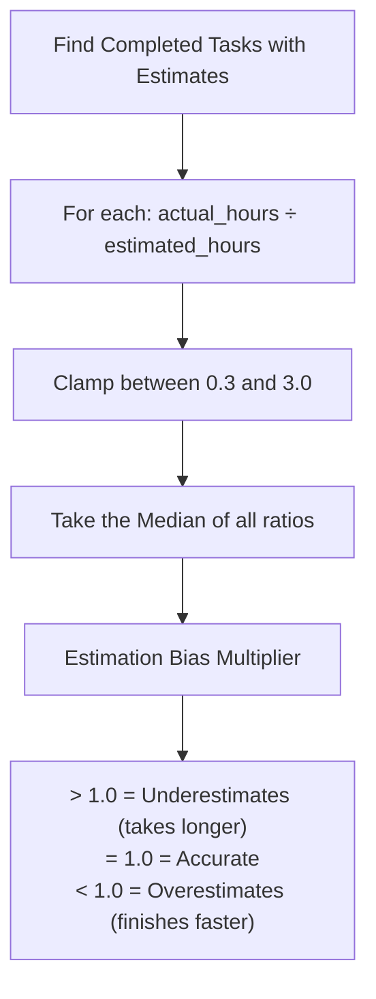

**Example:** If bias = 1.3, the student underestimates by 30%. The system multiplies remaining work by 1.3 to compensate.

> The system tells the user: *"⏱️ You tend to underestimate tasks by ~30%. Try adding padding to your estimates!"*

---

## Step 4: Completion Velocity & Trend

### Completion Velocity
Measures how fast task completion percentages are growing per week:

```
For each in-progress task:
  completionVelocity = completionPercentage ÷ weeksElapsed
Average across all in-progress tasks
```

### Velocity Trend Detection
Splits the weekly velocity history in half and compares the older half to the recent half:

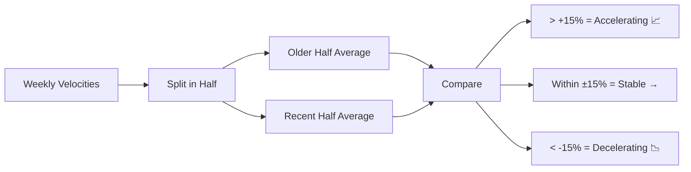

### Blended Velocity
The system blends both velocity signals:
```
blendedVelocity = (logVelocity × 0.70) + (completionVelocity × 0.30)
```

This ensures the prediction uses both your logging activity AND your task progress.

---

## Step 5: Risk Multiplier & Dependencies

**Problem:** Blocked tasks, overdue work, stagnation, and broken dependency chains should slow down the predicted velocity.

**Solution:** Calculate a risk multiplier ≥ 1.0 that penalizes the velocity:

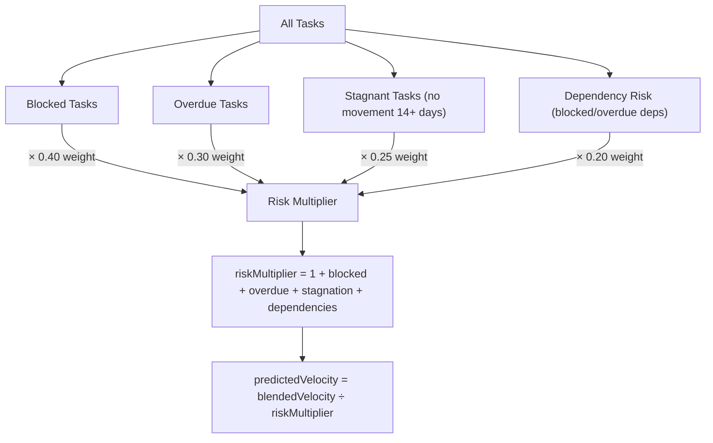

Each factor is **weighted by priority severity**:
| Priority | Severity Multiplier |
|----------|-------------------|
| Critical | 2.0× |
| High | 1.5× |
| Medium | 1.0× |
| Low | 0.6× |

### Dependency Risk (New Feature)
If Task B depends on Task A, and Task A is blocked or overdue, Task B gets an additional risk penalty. This cascades through dependency chains automatically.

---

## Step 6: Monte Carlo Simulation

**Problem:** A single point estimate ("you'll finish in 8 weeks") is often wrong. We need a RANGE.

**Solution:** Run 200 simulated futures using randomized velocities drawn from the student's actual velocity distribution.

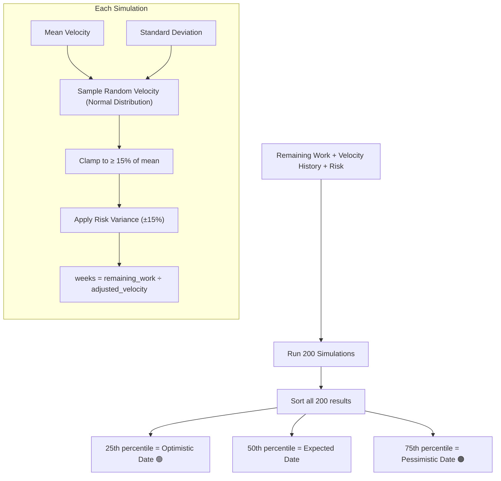

**Why this works:** Instead of guessing, the system tries 200 different "what if your speed changes randomly?" scenarios. The range between the 25th and 75th percentile gives you a realistic window.

**Deterministic Randomness:** The simulation uses a seeded pseudo-random number generator (seed=42) so the results are reproducible — the same inputs always produce the same outputs.

---

## Step 7: Bayesian Confidence Score

**Problem:** How much should the user trust this prediction? If there's only 1 log entry, the prediction is basically a guess.

**Solution:** A Bayesian-inspired formula that adds "evidence" from multiple sources:

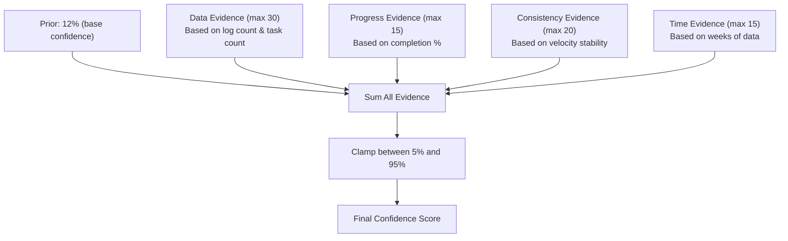

| Source | Formula | Max Points |
|--------|---------|-----------|
| **Prior** (starting point) | Always 12 | 12 |
| **Data Evidence** | 15 × (1 - e^(-logs/8)) + 10 × (1 - e^(-tasks/5)) | 30 |
| **Progress Evidence** | progressPercentage / 5 | 15 |
| **Consistency** | 20 - (coefficient_of_variation × 20) | 20 |
| **Time (weeks of data)** | velocities.length × 3 | 15 |

**Example:** A student with 20 logs, 8 tasks, 60% progress, and consistent speed might score: 12 + 24 + 12 + 15 + 12 = **75% confidence**.

---

## Mood-Productivity Analysis

Separate from the deadline prediction, this module analyzes the relationship between mood ratings and productivity:

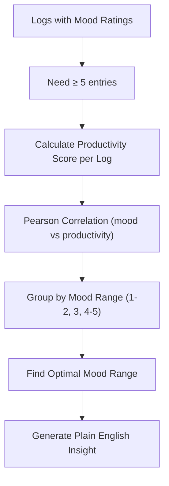

**Productivity Score Formula:**
```
score = taskStatus points (done=10, inprogress=5, todo=2)
      + min(5, description_length / 50)
      + feedback bonus (3 if > 10 chars)
```

**Correlation uses Pearson's formula:**
- `> 0.5` = Strong positive link (good mood → more productive)
- `0.3 to 0.5` = Moderate link
- `< 0.3` = Weak/no link

---

## Risk Detection System

A separate multi-factor risk system that generates alerts:

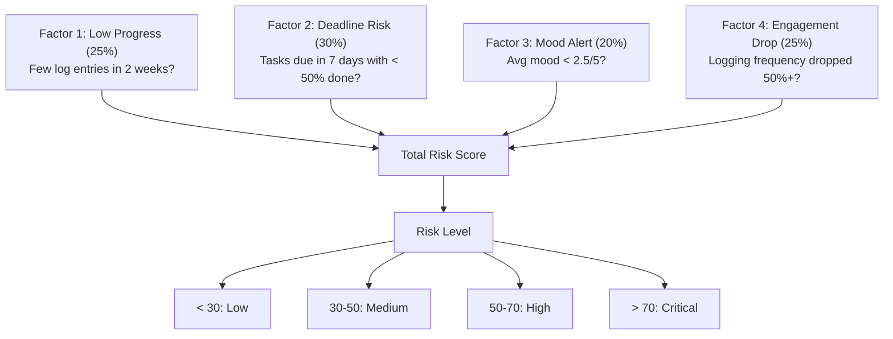

---

## Liora's Insight Cards

**New Feature.** The system generates plain-English insight cards by analyzing the prediction output:

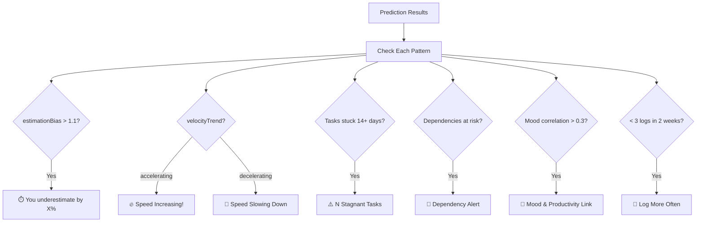

Each card is rendered as a glassmorphism card with a colored accent border, emoji, and conversational advice text.

---

## Logging Streak System

**New Feature.** Tracks consecutive weeks where the student logged at least once:

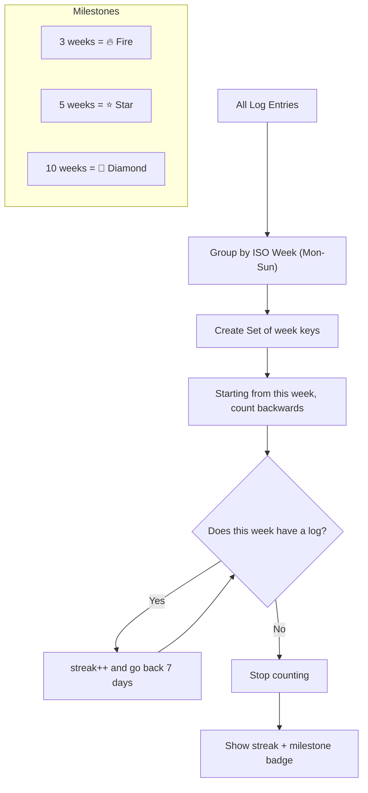

---

## What-If Simulator

**New Feature.** An interactive slider on the Progress Report page that lets users explore "What if I work faster/slower?"

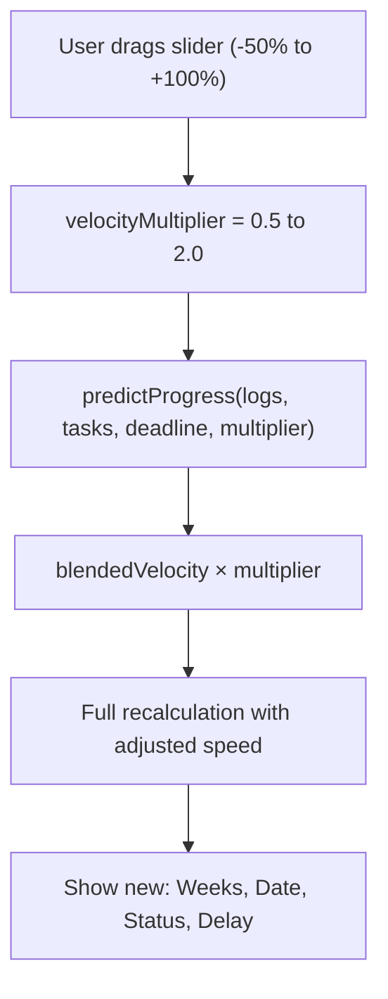

The slider does NOT change any saved data. It simply passes a `velocityMultiplier` parameter to `predictProgress()`, which scales the blended velocity before the prediction is calculated.

---

## Task Dependencies

**New Feature.** Tasks can now declare "I depend on Task X":

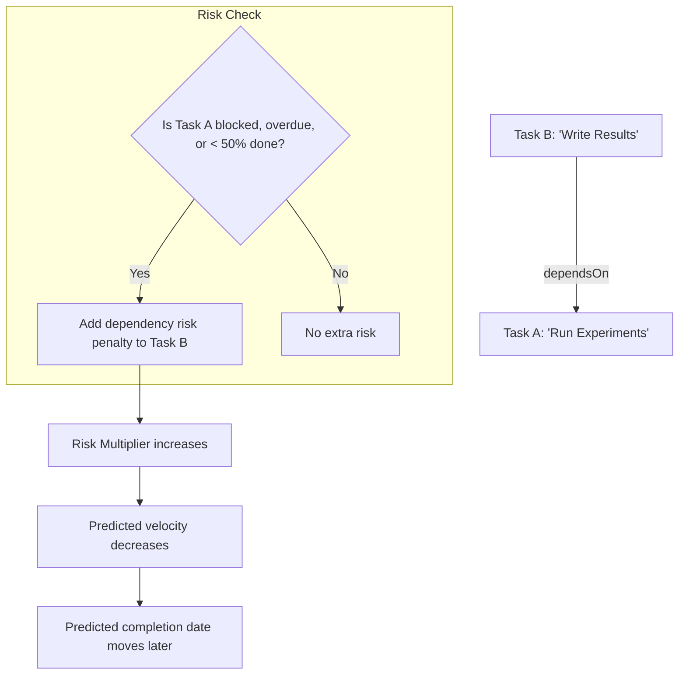

When a dependency is at risk, the system adds a weighted penalty:
```
dependencyRisk += (workRatio × prioritySeverity × 0.5)
```

This penalty flows into the overall Risk Multiplier and automatically adjusts the predicted deadline.

---

## Full System Flowchart

This is the complete end-to-end picture of every module and how they connect:

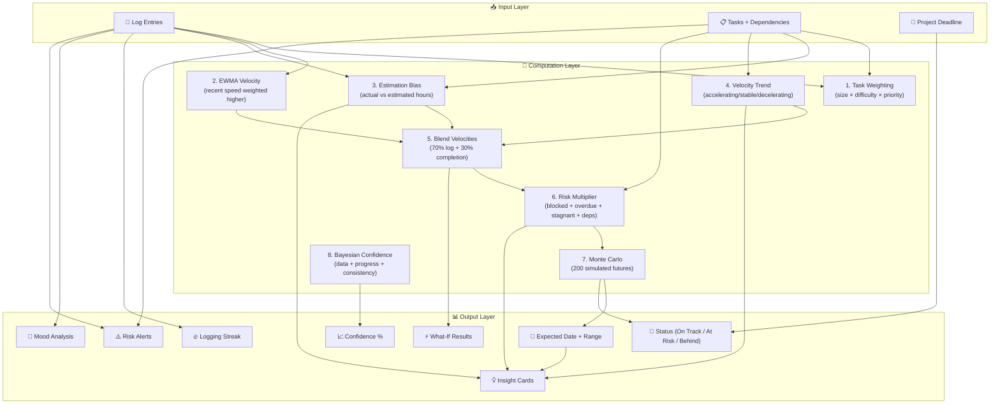

---

## Summary

| Component | Algorithm Used | Why This and Not ML? |
|-----------|---------------|---------------------|
| **Speed Tracking** | EWMA (α=0.4) | Works with 3+ data points; ML needs 1000+ |
| **Bias Detection** | Median Ratio Analysis | Simple, interpretable, no training needed |
| **Date Prediction** | Monte Carlo (200 sims) | Gives ranges, not guesses; works with small data |
| **Confidence** | Bayesian Evidence Fusion | Gracefully handles "not enough data" |
| **Risk Scoring** | Weighted Multi-Factor | Fully explainable; user can see exactly why |
| **Mood Correlation** | Pearson Correlation | Standard statistical test, no training needed |
| **Insight Generation** | Rule-Based Thresholds | Deterministic, no hallucinations |
| **What-If** | Velocity Multiplier | Instant recalculation, zero latency |

> **Bottom Line:** Every algorithm was chosen because it works well with small-to-medium datasets (10-100 entries), runs instantly in the browser with zero server cost, and produces explainable results. No black boxes.
